# Process Document
## Initial Idea
To start with, the main idea for this project was actually thought up before I'd even received the assignment — I already wanted to try and make a rhythm game that uses MIDI files to automatically generate playable levels, so users could create their own custom rhythm games.
Once I had the idea, I got Claude to build a basic engine that fairly directly converted input MIDIs into 4 tracks which could be played with the arrow keys.

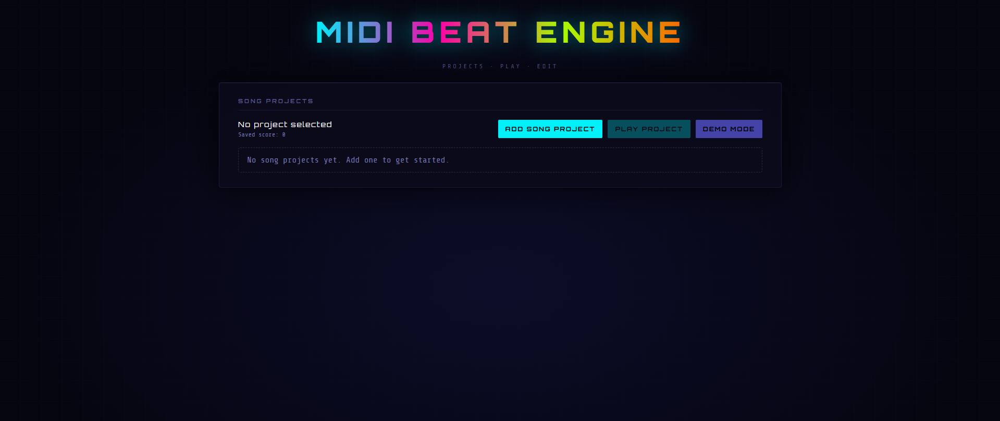

## Added More Customisation and Track Settings
From this I had a base structure, but it still needed a lot of work, so I added a simple editor menu that allowed users to tweak values for things like Note Speed, track assignment (as most MIDIs use multiple tracks for different instruments, this setting let me choose which track to set as Playing, Backing, or Off), track volumes, and much more. Doing this helped a lot with making songs more deliberate and actually playable. To further help, I also made the beatmap generator merge notes that were extremely close together into long notes that needed to be held down. This helped a great deal, as long notes in the MIDIs I used were just being turned into very closely spaced consecutive notes that were extremely difficult to play. Later this system became more advanced, with me asking CoPilot to make the beat-mapping algorithm find these rapid consecutive notes and read them as long notes with set start and end times. This resulted in them overlapping other notes, which was also a problem I fixed by forcing long notes to end before the next note played, while letting that note continue without input for its proper length.
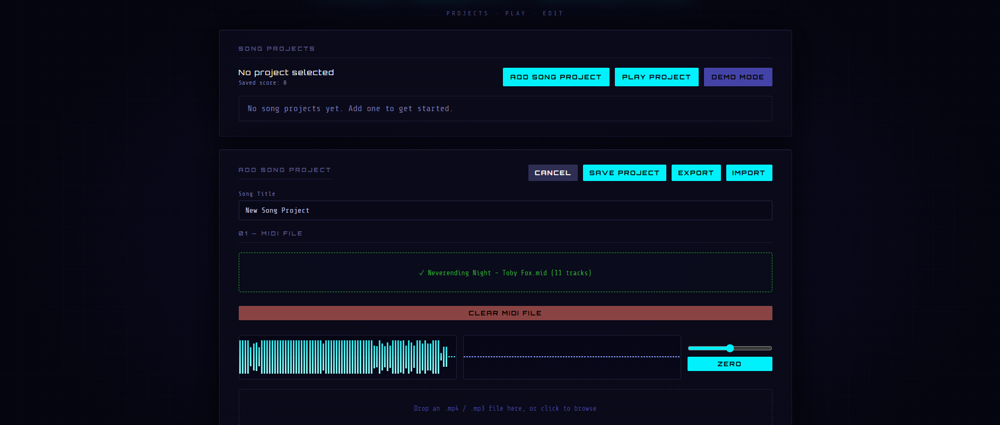

## Improving How the Game Sounds / Adding Optional MP3s
Now that I had fixed the gameplay I wanted to work on how the songs sounded, as one of the major limitations of building a game around MIDIs is that they don't sound very good on their own. So I got CoPilot to add the ability to attach an MP3 that plays alongside the song, giving a better-sounding backing track to the gameplay. Due to some issues with alignment I also added another setting to tweak the starting time of the MP3, along with a sound-wave visualiser for each file to help line them up — though it is still somewhat difficult without trial and error.

## Initial Manual Tracking
At this point I had been adding a bunch of songs to test the game, and I found that even when using MIDIs with backing MP3s it still didn't feel right while playing, as the overly complex MIDI beatmaps never matched the simpler lead instrumentals and vocals of the MP3s. So I got Claude to add a manual tracking feature where you could play through a song and record a beatmap, which would then be applied to it. This allowed me more control over the actual gameplay of song projects, and helped with balancing difficulty, as most of the MIDI files I'd found up until that point were either very long or had far too many notes to make a balanced difficulty progression.

## Battle Mode
At this point the basic 4-lane rhythm game was mostly working, but I still felt the gameplay was lacking, so I thought about rhythm games I enjoyed playing. While working on the project I was playing quite a bit of Friday Night Funkin', an indie rhythm game about fighting people with songs — it was free and could run on my laptop. Through playing it, I found the most enjoyable part was competing against an AI, with their notes either giving a preview of what you were about to play or singing at the same time during the more impactful sections. So I decided to try and incorporate the parts I liked into my own game, getting Claude to add a second set of lanes on the left side of the screen called the Reference Track, which would receive around half of the beatmap's notes using the following rules:
1. If the beatmap has a repeating pattern of notes, the tracks will swap on each loop.
2. The tracks should try to swap whenever there is a gap in the beatmap, rather than cutting mid-sequence.
3. The player should always end the song, being required to play at least the last 7 notes (this was mostly due to a bug where the results screen would appear as soon as the player played their last note, meaning songs could end before finishing).
4. The player must receive around 60% of the beatmap's notes, to stop songs from being played entirely on the reference track.
5. Remarkably loud moments in the song should be played by both tracks simultaneously.

With this basic set of rules the songs were able to be split between the two tracks, creating a sort of Battle mode, which later had more rules added to improve how it played, particularly in Tour Mode.
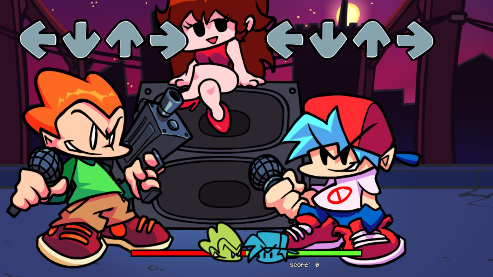
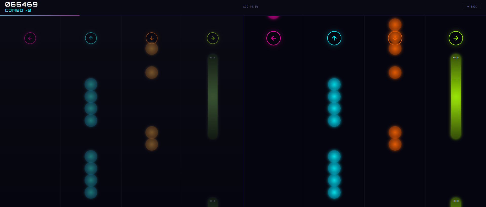

# Adding Characters
## First Character and Ideas
Another aspect I liked in Friday Night Funkin' was that each song featured a unique character to fight against, with each one using a distinct sound and voice. I thought that with all the customisation available in my game it would be cool to have a group of characters each using different MIDI instruments, allowing songs to feel unique just by swapping character.
Since I didn't really have any ideas for which characters to include, I started with just making Mushy — a character I had recently worked on in my previous project. This meant I could reuse the design with some small tweaks and higher-resolution animations to speed up the process, and base his instrument on the dialogue sound already used in that earlier project.
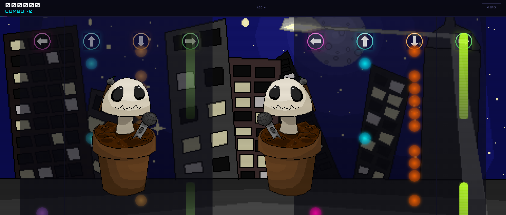

## Making Them Sound Unique
Once I had made some art and collected some sound effects, I got Claude to build a character selector that would affect the track instrument and display an animated sprite based on the user's choices. From this I tried using the DialogueBlip.wav sound clip to create Mushy's voice, though I later found this was a bad idea as the clip was far too short for long notes to reliably loop and couldn't match the different pitches of the song. So instead I got CoPilot to read the WAV file and try to recreate the sound in code, which worked much better — matching notes and looping naturally.
I also added a taunt system, which was planned to play a unique taunt animation and sound from Mushy's original game. I wanted the player to be able to interact with the characters even when not currently playing (at this point many songs had large sections where the reference track would play by itself). This also let me reuse more assets from things I had already made.

## More Characters Added
After that I added more characters to test how different instruments would interact in songs. I added Puppet (originally named Martin — not a reference to anything I made, just a random name), which had a lower-pitched, bassier instrument to complement Mushy. I also made a Recorder character mainly to test having a separate vocal track and backing track in the game, getting CoPilot to write in a hidden Vocal Track upload which the Recorder could play instead of their instrument, with the vocals' volume changing depending on how well the song is played. Later these characters were tweaked: Martin became Puppet, a reference to a hand-tracking fighting game I made last year, using a grittier, more compressed sound to better recreate the voice of an old fighting game character. Recorder kept the name but used modified sprites of the player character from a design website I had made earlier in the year.

## The Story of the Missing Character
One character I spent a lot of time making only to cut at the very end was Tote. At the time I was working on the project I had been listening to a lot of songs featuring Kasane Teto, a vocal synthesiser made by UTAU. Since I still wanted at least one character to use actual vocals instead of coded sounds, I had a practice 3D model I made of Teto to relearn Blender, and UTAU was free, so I decided to make a Teto-inspired character called Tote. To start with I learned how to use UTAU, which meant watching a lot of tutorials to get it working in English. After figuring that out, I made a bunch of WAV files using random syllables (as I thought using actual words would sound strange in-game) and tried to make a MIDI soundfont out of them. This failed as the existing code couldn't read SoundFont files. So, not wanting to give up, I asked CoPilot to write code to create a MIDI instrument from a series of sound clips, which produced the ToteSound.manifest and MushySound.manifest files. This still didn't work correctly — the sound clips weren't properly looping or matching the song's notes. Still not giving up, I tried vibecoding a fix for many hours until it finally worked, but sounded horrible. Since I still had to finish rigging the Tote 3D model — which would require manually rigging every bone — I decided to move on so I could come back to it later. As I got closer to the deadline with many things still to do, I ended up cutting Tote from the game a few days before submission.
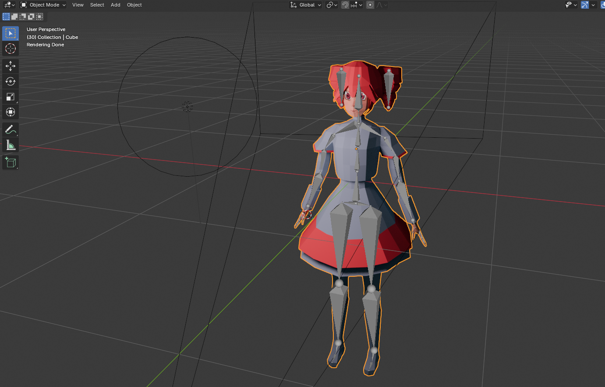

# Further Development
## Background Art
Next I quickly drew up some background sprites that could be selected in the settings, since it didn't feel right to have characters standing in an empty void. Each scene uses a few frames that swap between each other smoothly in code. I only ended up making three scenes: City Night, Dam View (which reused a background art asset from an RPG I made three years ago — the same project was planned to have a character using the Hero spritesheets, though they were cut as they required three new animations for the different directions), and Convenience Store, which used a 3D model from a movement-shooter game I made over the summer break.

## New Game Modes — Solo, Piano, Auto
Throughout the project I had also been planning alternative game modes to help represent many different styles of rhythm game and to allow users to create even more types of rhythm-based games.

In the end only three game modes were actually added: Solo Mode, where the entire beatmap is placed on one track and must be played entirely by the player; Piano Mode, a mode that initially had 10 different lanes for different keyboard keys to create a more challenging gameplay style (later reduced to 8 and then 6, as it was very difficult to play with too many lanes to track at once); and Auto Mode for testing, which would play a song project in Battle Mode for you.

All these modes were created by drawing up a list of rules and asking CoPilot to code them in, with each mode requiring a different layout that had to be manually tweaked.

## Planned Game Modes That Didn't Make It In
There were many modes I had planned to add, but most were cut simply because coding them in, testing their layouts, and balancing them would take too long. The modes I most wanted to add were Battlefield Mode, Drum Mode, Shield Mode, and a Gauntlet mode.

Battlefield Mode was inspired by games like Crypt of the Necrodancer and would have the player dodging tiles on a grid that become dangerous in time with the song, with each note having a different placement and effect. It would also have used art from the RPG I made three years ago, which had a very similar gameplay style.
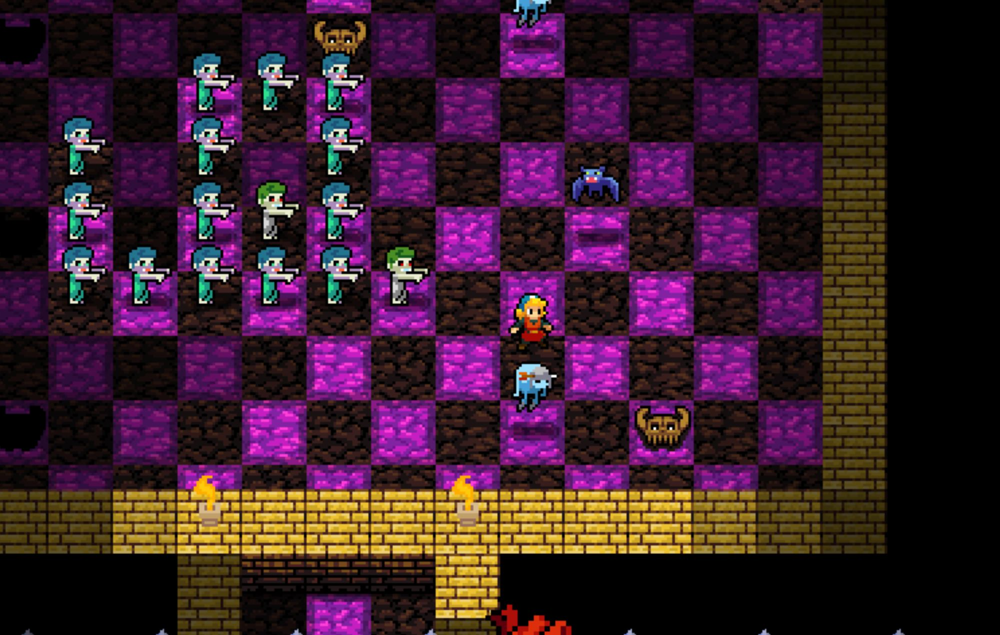

Drum Mode was loosely based on Taiko no Tatsujin — designed as the opposite of Piano Mode, with only one or two input lanes but much more complex notes.

Shield Mode was based on Beatblock, where each note would create a projectile that flew at the player and had to be blocked by a shield they could point in any direction. The beatmaps would not be able to contain two opposite notes at the same time, or any other sequences that were impossible to play.
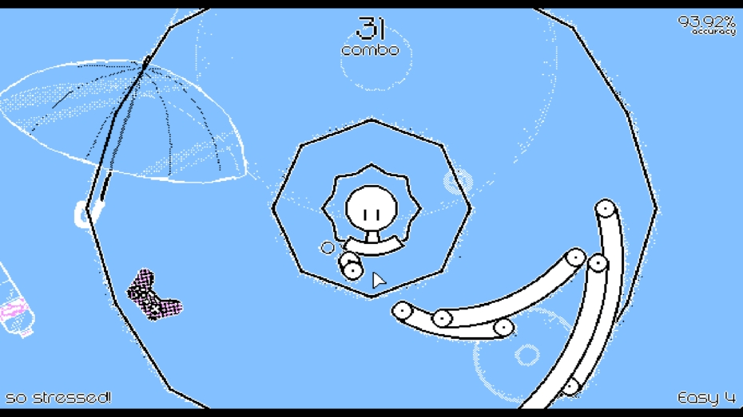

Gauntlet Mode was a combination of all these, loosely inspired by the Rhythm Heaven series: it would randomly swap modes throughout a song, forcing the player to quickly adapt their playstyle. This mode lives on in some ways in the Tour Mode I added later, which uses a randomly selected mode for each song.

## Adding Difficulties
At this point all the modes were stored in a difficulty selector, with Easy and Normal representing different difficulty levels of Battle Mode, Hard using Solo Mode, and Master using Piano Mode. Since I wanted difficulty and mode to be separate concepts, I made the project settings control the mode and the play menu control the difficulty. The three difficulty levels initially decided how the beatmap handled rapid notes: Easy merged them into a single long note, Normal combined them into fewer inputs, and Hard left them as-is. This was quickly changed to instead tweak things like timing windows — Easy being more generous — and slightly altering the Merge Threshold to produce long notes, with Easy merging notes that are further apart than Hard would. This change was mainly due to the number of bugs the initial mode-based settings caused, especially Normal, which would stack notes on top of each other making them impossible to play with correct timing.

## Improving Battle Mode
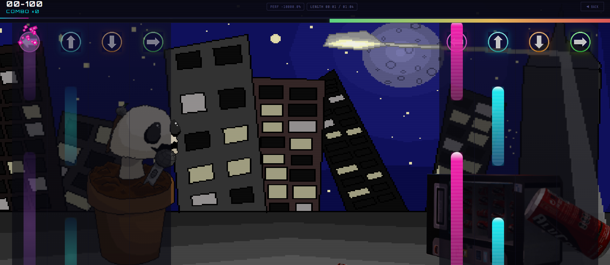

Towards the end of development I spent more time refining Battle Mode, as it was my personal favourite. I added a health bar that can end the game early, as well as two new rules:
6. In sections with many notes across different lanes, the track will split — the reference track plays some lanes while the player plays the rest. This must happen at least once per song.
7. The reference track must play at least 10% of the song's notes to prevent player-only songs.

I also added mechanics like a grace period where, if a player makes a mistake, they can keep their combo unless they mess up again within the grace window. I changed combos so that each note's contribution to the score modifier decreases the longer the combo goes, making scoring less exponential and helping the player achieve a score closer to the Perfect Performance rating. This determines how well a player must perform to pass stages in Tour Mode — before this change, most attempts scored between 7% and 15%, making stages seem far harder than intended.

## Moving Camera
After that I further improved the game by getting Claude to add a moving camera that transitions between four positions: zoomed in on the player, zoomed in on the rival, zoomed out to the centre, and a player-specific zoom for Solo Mode.
This made Battle Mode feel much more dynamic without being too distracting from the gameplay.

# Adding Game Content

At this point there were plenty of mechanics and customisation options available, but the game still lacked any built-in content — it felt more like an engine for creating games than a game itself. To fix this I wanted to add some content that would be immediately accessible to players who just wanted to play without worrying about building their own songs. I settled on two solutions: pre-installed songs in the play menu to help demonstrate the different options, and a roguelike Tour Mode.

## Tour Mode
Tour Mode probably took the longest of the two to build. The main idea was to use an online database of MIDI files, pick one at random, and convert it into a playable level. By using multiple databases with thousands of MIDIs I was able to create a decent variety. However, this still caused many issues — I had to research and test many different databases before finding ones that worked consistently, and even then the MIDIs would sometimes fail to play, crash the game, or produce a very loud noise when loaded as a level. Through a lot of trial and error I eventually got Tour Mode working, using Claude to build a character select screen so players could choose who to play as (each character now requiring their own portrait art), and a loading screen where two slot wheels spin to select the song to play next.

In the current game this works by first finding 20 random songs with progressive difficulty. The player can choose between two per stage to avoid being forced to play six-minute songs, and has 3 lives to reach the 10th stage before losing. Every character has a unique victory screen (except Recorder), which I ran out of time to fully test.

In the originally planned version it would have incorporated more roguelike elements, with every 3 stages letting the player spin for a modifier that would affect gameplay. For example:
- "No Such Thing as Bad" — removes the Bad timing window, splitting it into either Good or Miss.
- "Glass Cannon" — increases both the health gained and health lost per note in Battle Mode.
- "Impossible Mode" — 50% chance to play in Piano Mode each stage.

Due to time constraints, these modifiers were removed.

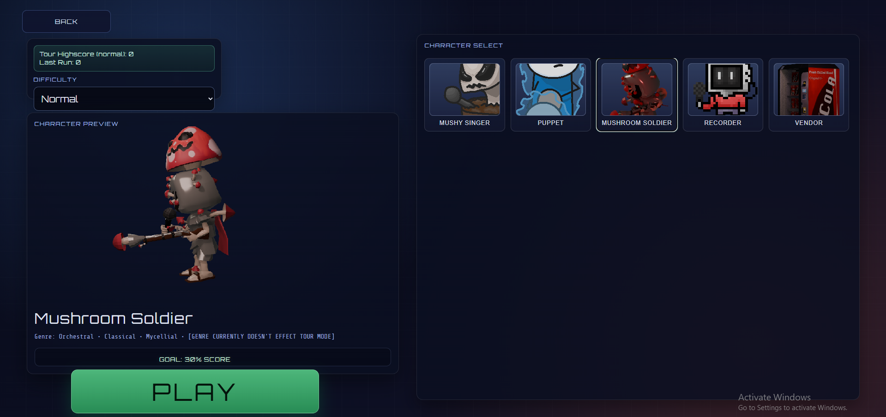

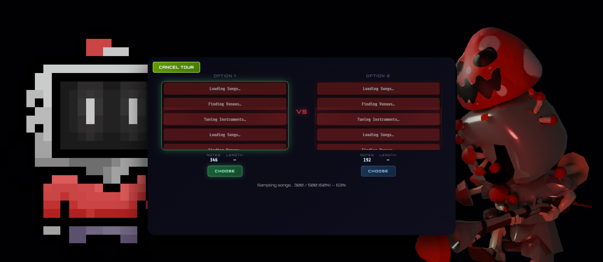

## UI Redesigns and Improvements
Around this time I also wanted to overhaul the UI, as up until that point most of it had been built in the same style as Claude's initial prototype rather than my own. So I first made a Main Menu screen with a new title and buttons for the three different menus: Play, Editor, and Tour. Originally the Editor was a pop-up menu overlaid on the Play screen with some tweakable values — since this overcrowded the screen and was awkward to use, I sketched up a new menu design and got CoPilot to code it using a more deliberate layout where songs could be selected and their settings were separated into Project Settings and Song Settings windows.
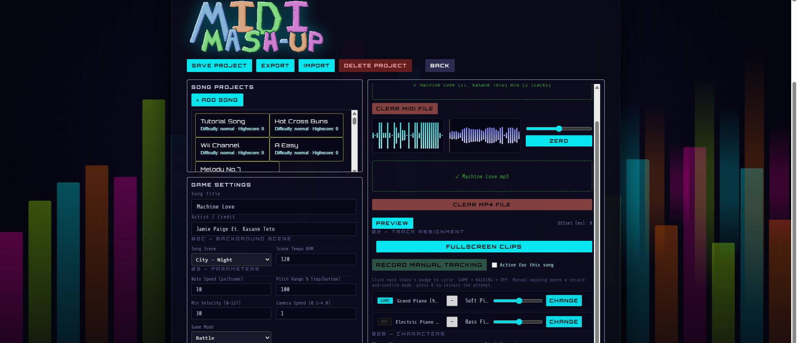

The Play menu was also redesigned to be much cleaner, with better button placement and larger song cards for easier navigation. I also added features like a song preview that would play either the selected song's MIDI file or its backing MP3, though this was cut due to the MIDI preview failing or carrying over and overlapping with other menus. A new title and sound visualisers that reacted in time to the selected song were also added.

In the Main Menu I added two side buttons where a random character portrait is shown and can be clicked to play that character's taunt sound.
In the end, the least-changed menu was the Tour Mode Character Select, as I didn't have time to redesign it, so it still uses the layout Claude originally generated.
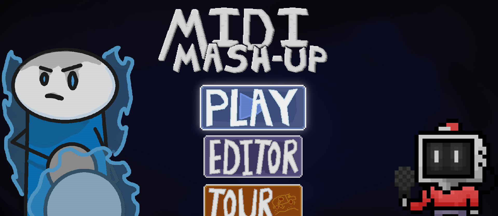

## Added More Characters While Making Tour Mode — Mushroom Soldier and Vendor
I was also spending some of my time finishing animations for two new characters: Mushroom Soldier, planned from the start to use the 3D model I made for my Game Design project last year (Mushrum), and Vendor, a vending machine character I made at 2AM by moving the Convenience Store's vending machine around in Blender. There was one other 3D character I wanted to add at this point but also cut for time — the Bleeder, an enemy model I had made over the summer for my movement-shooter game. Each character also received new character vocals: Mushroom Soldier has a lower, more string-instrument-like sound, and Vendor has a high-pitched electronic beep to sound more like a machine.

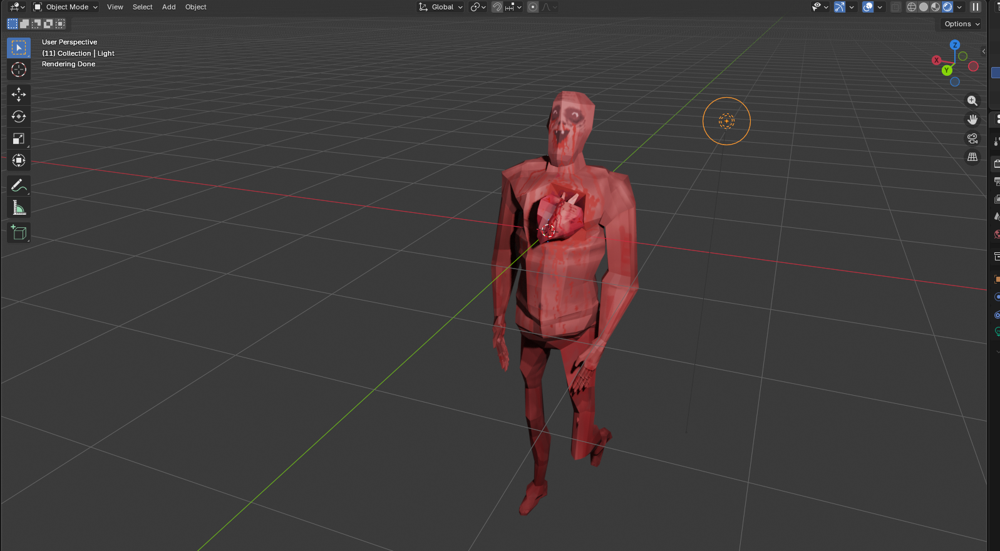

## Prebuilt / Free Play Songs
Along with Tour Mode I also made a system for adding prebuilt song projects, simply requiring me to export a song project file and drop it into the code. Initially I wanted to use only copyright-free songs as prebuilts, but this proved difficult as most of the copyright-free MIDIs I found either sounded terrible or produced very awkward beatmaps. Instead I ended up using some of the more common MIDI files based on copyrighted music, as well as a lot of song projects I had used for testing and never originally intended to include — due to running out of time and needing to demonstrate mechanics like backing MP3s and vocal tracks.

This prebuilt system also produced many bugs, with several files becoming corrupted when added, being completely muted, or breaking parts of the code — which wasted a lot of time in the final days.

I also wanted to add a tutorial song to help familiarise players with the basic controls, inspired by how it is done in games like Friday Night Funkin'. This required a significant overhaul of the manual tracking code, allowing users to control the length of songs independently of their MIDI files, and adding the ability to manually track for each mode — Battle being particularly complex, as I wanted to be able to control both the Reference Track and the Player Track simultaneously. After a few days of fixes, rebalancing the sound, and extensive vibecoding with Claude, I got it almost working correctly, with some visual and audio issues still remaining.

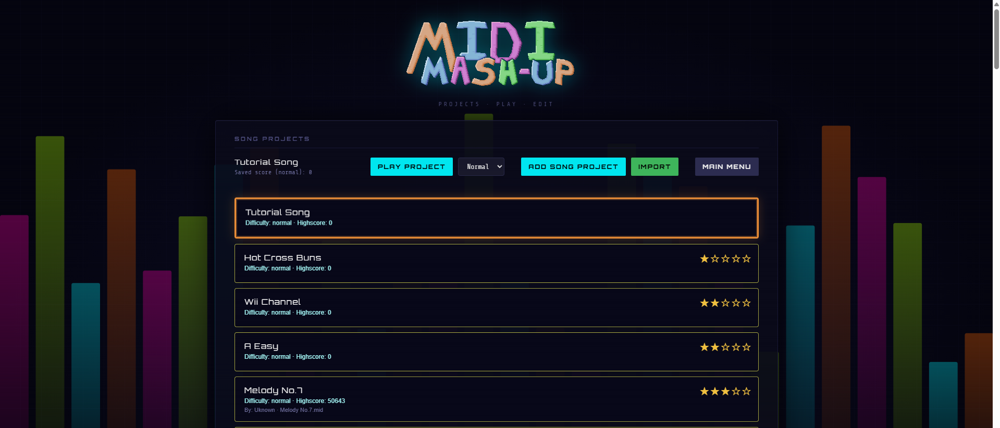

## Final Bugs and Issues
Once that was done I did one last pass through the UI to get everything working — things like character portraits would often appear in incorrect positions — and worked on fixing the many remaining bugs.

Some notable issues I ran into in the last week were:
- **Sound not loading** — There were many instances throughout the project where audio would either cut out, start muted and gradually unmute, or just become very quiet seemingly at random, with no errors appearing in the console. Each time I thought I had fixed it the problem would return, and I spent multiple days trying to resolve it with Claude's help.
- **DialogueBlip curse** — Something I hadn't considered for a long time was that the default fallback sound was the original Dialogue Blip from Mushy's source project. Since it hadn't come up much until that point, I didn't notice until sounds started failing to load en masse and everything started playing as rapid, loud, short notes.
- **Many, many more** — When I started writing this I planned to document all the issues I had to fix in the last week, but I've realised there are far too many to address before submission. I will say that the main reason these became such a problem in the final week relates to what follows.

## The Final Week
Since the project had grown far beyond what I could comfortably manage on my own, most bug-fixing and changes were done through vibe-coding, which became a massive problem when I suddenly ran out of CoPilot credits without warning. Although I also used Claude a lot for adding mechanics, I did most of my bug-fixing with CoPilot as it could be used much more frequently and had an immediate understanding of the code. Once it was gone, I turned to using Claude exclusively — which was a problem, as I would often only get one or two responses every five or so hours, making development very slow even across multiple accounts, and slower still due to my poor Wi-Fi. Since I was very pressed for time I ended up appending every prompt with "Please ensure you are extremely concise with your responses mostly just writing the code and very sparingly writing 1 to 2 short sentences for your planning, process, or summaries" to try and get more responses.

I ended up working on the project for almost five days straight in the final week, leaving me extremely burnt out by the end — having added a working Tour Mode, two new characters, Battle Mode improvements, UI changes, prebuilt songs, updated manual tracking, and much more all within that last week.
Next time I work on a project like this I definitely want to cut the scope down to keep the code more manageable (the current ~13,500 lines is extremely difficult to read and debug), especially given the limited time I had due to other assignments.

# Conclusions
In the end I am still quite proud of what I've made, and although a lot of content had to be cut I'm glad with how much made it in. My main regret is trying to rush everything into the last few days.

## Do I Think I Met My Criteria?
As for how well I accomplished my success criteria, I believe:

 1. **Create something enjoyable to use.**
I believe I created something with decently enjoyable and satisfying controls and gameplay. Some of the more complex features like manual tracking and advanced editing are a bit hard to understand without a tutorial, but I feel the main mechanics are simple enough to pick up.

 2. **Create something polished enough, both mechanically and visually, to upload to itch.io as a game.**
I feel mixed about this. The project seems mechanically polished from my tests, though I do still worry there may be bugs I haven't found yet. Visually, the game intentionally uses mixed media to add variety to the characters, and some of the animations, victory screens, and UI could be further polished. For a game intended to launch in Early Access on itch.io I think it is still in decent shape.

 3. **Create something that gives the user a variety of ways to interact with it and play it.**
I believe I've provided a variety of ways to interact — around 10 prebuilt songs, Tour Mode with thousands of possible songs to play, and three different game modes. Although I wish I could have added more modes and more variety to Tour Mode, I believe there is enough here for someone to feel satisfied.

 4. **Create something with built-in content, so it's accessible to people who don't want to engage with the more complex customisation systems.**
With the prebuilt songs and Tour Mode I believe I have successfully reached this goal.

 5. **Have something usable enough that it can be playtested to find ways to improve it.**
From my own tests I haven't found any game-breaking bugs. I unfortunately haven't had other people playtest it yet, but I do believe it is playable in its current state and could generate useful feedback.

## For Next Time
In the future I definitely want to improve the built-in songs, possibly making a campaign mode and having the songs sound more refined and less ear-grating at moments. I would also want to add the other planned modes, as I personally think they would be a lot of fun to play with. The main takeaway from this project is being willing to drop things that are taking too long and to pull the scope back towards the end to properly focus on polish — most of the last week was spent still adding content rather than refining what was there. Though given all the other work I had on at the same time, there wasn't much room for a consistent schedule and plan.

# Some More Planning and Early Notes I Didn't Want to Remove

A customisable rhythm game where users can import MIDI files and tweak some settings to make a playable song, which can then be exported and shared with others.

These settings will allow users to adjust the sound, characters, and even the style of gameplay their song uses.

This has been an idea I've had for a while — it was originally something I wanted to add to my design website as a mini-game. Inspiration for using MIDI files specifically came from a Minecraft mod I played earlier in the year that let a player drag in any MIDI file and play it on instruments.

This, along with my general love for rhythm games, is what made me want to work on this project. I had already started prototyping it before I even knew about Project 3, though the prototype leaves a lot to be desired — it doesn't sound particularly good and the gameplay doesn't feel as satisfying as I'd like, which is definitely partly because it only uses basic, easy-to-code shapes for visuals.

My goal is to make sprites, sound effects, and many more additions to improve the visuals, and also find ways to better recreate the sound of songs and accurately match the beat. For this I'm probably going to add a way to use an MP3 for audio, and a way to create custom manual tracking by playing through a song and pressing keys on the beat.

**Characters:** The different characters will each represent a set of sprites and a soundfont tied to that character, using different sprites and sounds for the different modes.

**Modes:** The different modes will broadly be styled after different types of rhythm games, using the same 4 directional keys but displaying them in different layouts with different rules.

Settings: My plan is to simplify the settings to allow people to adjust their songs without being overwhelmed by options. One way I'll probably do this is by removing all the per-track sound settings, reducing them to Original and Character — Original using the MIDI's built-in sound, and Character using that character's assigned sound.

Sharing: Making sharing and storing songs easier to use, and if possible building a site where people can upload approved files, rate others' work, and display high scores. Also adding some files directly into the repository.

UI design: A cleaner UI where the main screen just shows Song Project files with symbols for characters, song titles, artist names, or the name of the person who made the project.
On this screen there will be Import and Add buttons — Import lets users bring in others' projects, while Add opens the settings menu for a new song with the option to upload a MIDI and an optional MP3 file. Both tracks will have previews showing their volume over time so the user can align them, and the system will also try to align them automatically. From there, individual tracks can be configured — set from auto tracking to manual tracking, and with the option to use original sound clips, character sound clips, or custom ones for things like guitars and pianos.
There will also be an option to expand into smaller adjustment settings where you can find things like note merge thresholds and the timing windows for Bad, Good, and Perfect.

Add a roguelike mode that uses increasing difficulty (either by selecting songs with more notes, tightening timing windows, or introducing other obstacles). Each stage has the character face off against a different character (which could have a random recolour to make it feel less repetitive despite using the same few characters).

Next steps:

- Improve UI, making a main menu, and more easily navigated song project settings and playback.
- Fix character audio so they can have unique sounds and taunts (also fix taunts so more than one works).
- Make an in-game MIDI maker (which lets users record different tracks for different sound clips using a keyboard).
- Make Roguelike Mode (which grabs a random MIDI file from a MIDI archive if I can find the API), with each song progressively getting harder.

Add more characters (could use Mushroom Soldier from Mushrum and the Husks from Vampire Heartattack).

## SoundFont Workflow

SoundFont characters are loaded from converted offline packs instead of parsing raw `.sf2` files in the browser.

Each `.sf2` file can have a sibling manifest named `*.manifest.json` in the same directory in the repository. The manifest points to pre-rendered sample files and may define one or more presets. When the manifest is present, the game loads those samples at startup and uses them for note playback. If a converted pack is missing, the existing fallback voice logic still applies.

This means you only need to convert new instruments once, when you add them to the repository. Uploaded MIDI songs still play normally at runtime — only the instrument pack is prebuilt.

Different modes:
- **Battle** — DDR style
- **Drum** — Two inputs, focusing on timing over different inputs
- **Piano** — A more difficult mode that functions similarly to Battle but with more inputs and slower songs
- **Gauntlet** — A mode that switches between modes mid-song, and may include some simpler input modes (inspired by Rhythm Heaven's minigame format)

In order to control scope for now I'll focus on making a polished DDR-style game mode with around 5 characters, and hopefully a roguelike mode.
For this I'll need to work on adjusting the note-generation algorithm to make it more enjoyable to play, then fix the bugs with the character voices and make them use soundfonts, which allow a variety of pitches from just a few WAV files.

Make modes and difficulty separate things:
- Modes are set in the song project settings; difficulty is set in the play menu.

Modes:
- **Auto** — Plays the game for you
- **Duel** — Standard game mode
- **Solo** — Mode where the player plays everything
- **Piano** — A more difficult mode where the player uses 9 or more inputs per song

Difficulties:
- **Easy** — Notes have larger Good and Perfect windows, rapid notes merge together more, no penalty for incorrect inputs, but only a 0.5× point multiplier.
- **Normal** — Current version of the game: windows are generous, but rapid notes must be played; there are fewer of them with each one containing more notes. 1× point multiplier.
- **Hard** — Shorter windows, every note is playable, and there is a 2× multiplier.
- **Master** — Perfect windows are only a few frames, and missing 3 notes in a row will instantly end the song.

